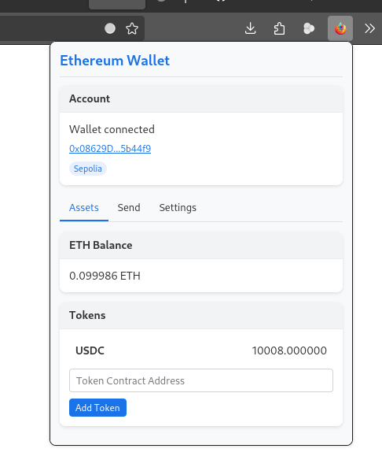
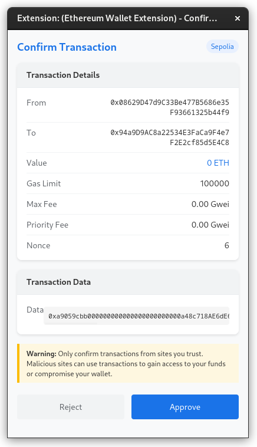
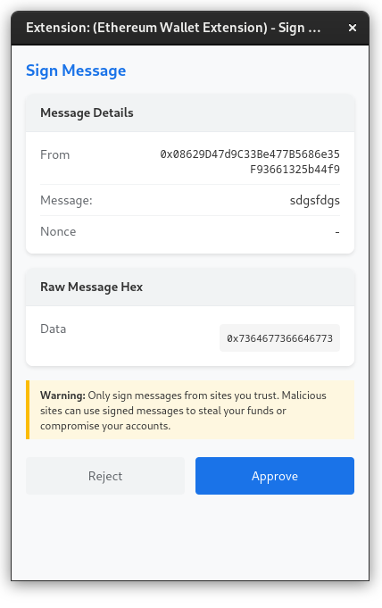

# Ethereum Wallet Extension for Firefox


A Firefox extension that implements an Ethereum wallet, providing the `window.ethereum` object to web applications. Compatible with Firefox for Android.

> [!WARNING]
> **This wallet is for TESTNET PURPOSES ONLY!** It is not secure for use with real funds on mainnet. The private key is stored in the browser's local storage without strong encryption. Use only for development and testing.

## Screenshots

<div align="center">
  
  
  
</div>

## Features

- Provides Ethereum wallet functionality through the `window.ethereum` API
- Supports multiple chains including Mainnet and Sepolia
- Manages private keys securely using browser storage
- Supports common Ethereum methods including:
  - `eth_requestAccounts`
  - `eth_accounts`
  - `eth_chainId`
  - `eth_sendTransaction`
  - `personal_sign`
  - `eth_signTypedData` and `eth_signTypedData_v4` (EIP-712)
  - Chain switching with `wallet_switchEthereumChain`
  
## Extension UI Features

The extension popup interface provides:

- Account management
- ETH balance display
- ERC-20 token tracking
- Token sending capabilities
- Message signing
- Network switching
- Simple private key backup

## Development Setup

1. Install dependencies:
   ```
   npm install
   ```
   or 
   ```
   yarn
   ```

2. Build the extension:
   ```
   npm run build
   ```
   or
   ```
   yarn build
   ```

3. Package the extension for Firefox:
   ```
   npm run web-ext
   ```
   or
   ```
   yarn web-ext
   ```

## Testing on Desktop Firefox

1. Open Firefox
2. In the address bar, navigate to: `about:debugging#/runtime/this-firefox`
3. Click "Load Temporary Add-on..."
4. Select any file in the `dist` directory (like `manifest.json`)
5. The extension should now be loaded and visible in the toolbar

## Testing on Firefox for Android

1. Enable debugging on your Android device
2. Connect your device to your computer via USB
3. In Firefox on your computer, navigate to `about:debugging#/runtime/this-firefox`
4. Click "Connect" under "Remote Debugging"
5. Select your device from the list
6. Click "Load Temporary Add-on..." and select the web-ext-artifacts ZIP file created by the web-ext command
7. The extension should now be installed on your Android device

## Building for Production

To create a production-ready package for submission to the Firefox Add-ons store:

```
npm run web-ext
```

This will create a ZIP file in the `web-ext-artifacts` directory that you can submit to the Firefox Add-ons store.

## Troubleshooting

If you encounter a Content Security Policy error when opening the extension popup, make sure:
1. The `popup.js` file is included in the `/dist` directory
2. The manifest.json has the proper CSP directive
3. The index.html references the popup.js file correctly

## License

MIT